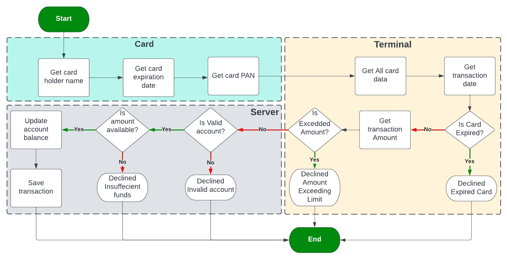
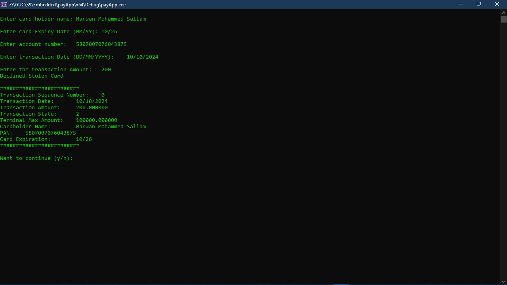

# payApp

## Overview
payApp is a secure payment application that stores, processes, and transmits cardholder data as part of authorization or settlement processes. The system includes comprehensive validation checks and follows industry security standards for payment processing.

## Project Structure
The development was organized into six main tasks:

1. **Development Environment Preparation**
   - Set up secure development infrastructure
   - Implement version control and CI/CD pipelines

2. **Card Module Implementation**
   - Card data collection and validation
   - PAN, expiration date, and cardholder name processing
   - Expiration and validity checks

3. **Terminal Module Implementation**
   - Transaction processing logic
   - Account balance updates
   - Decline reason handling

4. **Server Module Implementation**
   - Secure data transmission
   - Authorization protocols
   - Settlement processing

5. **Application Integration**
   - Unified interface for all modules
   - User and merchant dashboards
   - Transaction history

6. **Testing & Validation**
   - Unit and integration testing
   - Security penetration testing
   - PCI-DSS compliance verification

## Key Features
- **Secure Data Handling**:
  - Encrypted cardholder data storage
  - Tokenization for sensitive information
  - PCI-DSS compliant architecture

- **Comprehensive Validation**:
  - Account validity checks
  - Sufficient funds verification
  - Card expiration validation
  - Transaction amount limits

- **Modular Design**:
  - Separated card, terminal, and server modules
  - Microservices architecture
  - API-first approach

## Flowchart Logic
The payment processing flow includes:
1. Card data collection (PAN, expiration, cardholder name)
2. Validation checks:
   - ✅ Approved: All checks pass
   - ❌ Decline Reasons:
     - Invalid account
     - Insufficient funds
     - Expired card
     - Amount exceeding limit
3. Terminal actions:
   - Balance updates (approved)
   - Decline messaging (rejected)
## Working Example:

